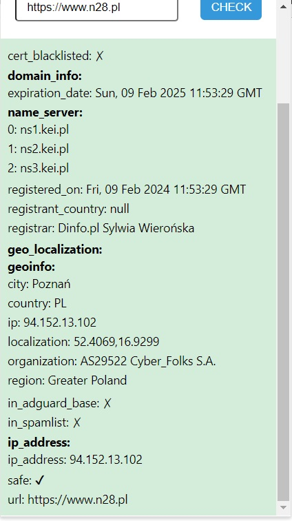

# SafeLinkBP

### Opis

SafeLinkBP to wtyczka do przeglądarki, która pozwala użytkownikom na sprawdzenie na podstawie dostępnych danych, czy dana witryna internetowa jest bezpieczna przed wejściem na nią. Narzędzie chroni klientów zabezpieczając przed integracją z fałszywymi witrynami, które mogą stanowić realne zagrożenie. Usługa umożliwia użytkownikom wklejenie adresu URL w celu weryfikacji danych witryny w czasie rzeczywistym i zapobiegania potencjalnym oszustwom.

### Funkcjonalności

Wtyczka sprawdza następujące informacje dla każdej odwiedzanej strony:

#### URL (raw_url): Pełny adres URL strony.

#### Adres IP (ip_address): Adres IP, na którym hostowana jest strona.

#### Bezpieczeństwo domeny (safe): Czy domena jest uznana za bezpieczną.

#### Nagłówki HTTP (headers): Informacje przesłane w nagłówkach HTTP.

#### Geolokalizacja (geo_localization): Lokalizacja geograficzna serwera.

#### Informacje o domenie (domain_info): Szczegółowe dane o domenie.

#### Czarna lista certyfikatów (in_cert_blacklist): Czy certyfikat strony znajduje się na czarnej liście.

#### Spamhaus Spamlist (in_spamhaus_spamlist): Czy IP strony znajduje się na liście spamowej Spamhaus.

#### RBL List (in_rbllist): Czy domena jest na liście RBL.

### Instalacja

Pobierz repozytorium git.
Otwórz przeglądarkę i przejdź do sekcji zarządzania wtyczkami/extensions. Na przykład chrome://extensions
Wybierz opcję „Załaduj rozszerzenie niezapakowane” i wskaż folder, w którym znajduje się pobrana wtyczka.
Aktywuj wtyczkę.
Użycie
Po zainstalowaniu wtyczki każda odwiedzana strona internetowa będzie automatycznie skanowana. Wyniki skanowania pojawią się w specjalnym panelu interfejsu użytkownika wtyczki.

Zrzuty ekranu

1. Wyłapany SCAM
2. 

2. Interfejs wtyczki
   

3. Przykładowy request - część 1
   

4. Przykładowy request - część 2
   
